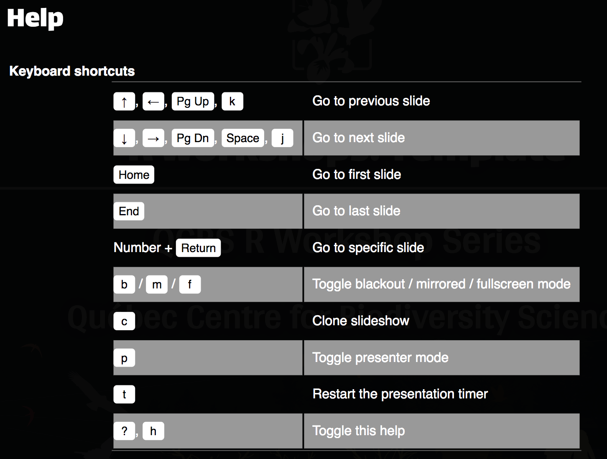

# R Markdown

<br>

This is an R Markdown document. Markdown is a simple formatting syntax for authoring HTML, PDF, and MS Word documents. For more details on using R Markdown see <http://rmarkdown.rstudio.com>.

When you click the **Knit** button a document will be generated that includes both content as well as the output of any embedded R code chunks within the document.


---
# Theme Xaringan

<br>

Install the **xaringan** package from the [CRAN](https://cran.r-project.org/web/packages/xaringan/index.html):

```{r, eval = FALSE}
install.packages("yihui/xaringan")
```
---
# Setup for your presentation

<br>

```{r setup, echo = TRUE}
knitr::opts_chunk$set(
  comment = "#",
  collapse = TRUE,
  warning = FALSE,
  message = FALSE,
  fig.width=6, fig.height=6,
  fig.retina = 3,
  fig.align = 'center'
)

options(repos=structure(c(CRAN="http://cran.r-project.org")))
```

---
class: inverse, center, middle

# Section slide

<hr>

## with a nice subtitle

---

# Headers 1 (with a blue background)

## Header 2 (similar to h1 with no background)

### Header 3

#### Header 4

##### Header 5

###### Header 6

Change slide using 3 dashes `---` (no space after the dashes)


---
# Text Formatting

### Text sizes

- normal size ( $\LaTeX$-friendly terms)
- `.huge[huge]` &nbsp; .huge[huge]
- `.large[large]` &nbsp; .large[large]
- `.small[small]` &nbsp; .small[small]
- `.tiny[tiny]` &nbsp; .small[tiny]
- `*italic*` &nbsp; *italic*
- `**bold**` &nbsp; **bold**


---
# Text Formatting

### Special class

- `.alert[alert]` .alert[alert]
- `.comment[comment]` .comment[comment]

### Use remarkjs's macros

- `` to scale an image
- `` &nbsp; 
- `` &nbsp; 
- See [FontAwesome cheatsheet](https://fontawesome.com/v4.7.0/cheatsheet/)

---
# Subsection Slide with bullet points

* a picture
* says more
* than a thousand words

or

- a picture
- says more
- than a thousand words

---
# Vertical Slide with bullet points

- Level 1 item
  * Level 2 item
  * Level 2 item
- Level 1 item


---
# Subsection Slide with ordered items

1. item 1
1. item 2

or

1. item 1
2. item 2

---
# Vertical Slide with incremental bullets

<br>

The easiest way to build incremental slides is...

--

to use **two dashes** `--` to separate content on a slide, and even bullet points:


--

- Bullet 1
--

- Bullet 2
--

- Bullet 3


<br>

And whenever you feel like a line break is needed, simply use `<br>`!


---
# Vertical Slide with Two Columns

.pull-left[
- You can place 2 figures on a slide
- Or 2 columns of text
- Using `.pull-left[]` for the first column
]


.pull-right[
- You can place 2 figures on a slide
- Or 2 columns of text
- Using `.pull-right[]` for the second column
]

---
# Table

Colons can be used to align columns.

<br>

| Tables        | Are           | Cool          |
| ------------- |:-------------:| -------------:|
| right-aligned | centered      | right-aligned |
| stuff         | stuff         | 123           |
| stuff         | stuff         | 456           |


---
# Text alignment

<br>

.left[
`.left[Left-aligned text]`
]

<br>

.center[
`.center[Centered text]`
]

<br>

.right[
`.right[Right-aligned text]`
]

---
class: inverse, center, middle

background-image: url(https://tailandfur.com//wp-content/uploads/2014/09/beautiful-and-cute-animals-wallpaper-9.jpg)
background-size: contain

# Include images


---
# Images

This image is centered and scaled to 60% of its real size, using:

`.center[  ]`

or

`.center[  ]`

.center[

]

---
# Images and text

<br>

.pull-left2[
Here `.pull-left2[]` and `.pull-right2[]`  are used to create a 2 column slide, where the left column is larger than the right column.
]

.pull-right2[
Beautiful picture


]

---
class: inverse, center, middle

# Use R!

<hr>

## Few examples

---
# Code chunk

You can embed an R code chunk like so:

    ```{R}
    library(datasets)
    summary(cars)
    ```
which yields:

```{R}
library(datasets)
summary(cars)
```

---
# Including Plots

```{R}
plot(pressure)
```


---
# Code chunk options
<br>

- `echo`:
  - `echo = TRUE` (default) to include R source code in the output file.
  - `echo = FALSE` to prevent printing of the R source code.
  - `echo = c(2:3)` or `-1` to include only line 2 and 3 from the R source code.
- `eval`:
  - `eval = TRUE` (default) to evaluate the code chunk.
  - `eval = FALSE` to prevent evaluating the code chunk.
  - `eval = c(2:3)` or `-1` to evaluate only line 2 and 3 from the R code.


---
# Code chunk options

<br>


- `fig.width`, `fig.height` to define width and height of the resulting plots
- `fig.align` to align the resulting plots

.alert[See more code chunk options at <https://yihui.name/knitr/options/>]


---
# Including Plots

With `echo = TRUE`:
```{r, echo=T, fig.width=7, fig.height=3.5}
par(mfrow=c(1,2), mar = c(4,4,0,1), las = 1)
plot(pressure)
plot(cars)
```


---
# Including Plots

With `echo = -1`:
```{r, echo=-1, fig.width=7, fig.height=3.5}
par(mfrow=c(1,2), mar = c(4,4,0,1))
plot(pressure)
plot(cars)
```

---
# Including Plots


If the option `highlightLines: true` is used for the presentation (declared in the YAML header), then add `#<<` at the end of the lines to be highlighted.

```{r, echo=TRUE, fig.width=7, fig.height=3.5}
par(mfrow=c(1,2), mar = c(4,4,0,1), las = 1)
plot(pressure) #<<
plot(cars) #<<
```

---
# Challenge slide! 

To include the rubicube in the challenge slide, you just need to type `` next to the slide title!


---
# Math Expressions

You can write $\LaTeX$ math expressions inside a pair of dollar signs, e.g. `$\alpha+\beta$` renders $\alpha+\beta$.

You can use the display style with a pair of double dollar signs `$$` :

$$\bar{X}=\frac{1}{n}\sum_{i=1}^nX_i$$


---
class: inverse, center, middle

# Keyboard shortcuts

<hr>

<br><br>

---
# Keyboard shortcuts

To see these shortcuts during a presentation, press **h** or **?**

.center[]

---
# Questions? Comments? Suggestions?

<br>

##### Use the GitHub repository

######  <https://github.com/QCBSRworkshops/>

<br>

##### or contact Marie-Hélène

######  [marie-helene.brice@umontreal.ca](mailto:marie-helene.brice@umontreal.ca)


---
class: inverse, center, bottom

# Thank you for your implication!

<hr>


<br>