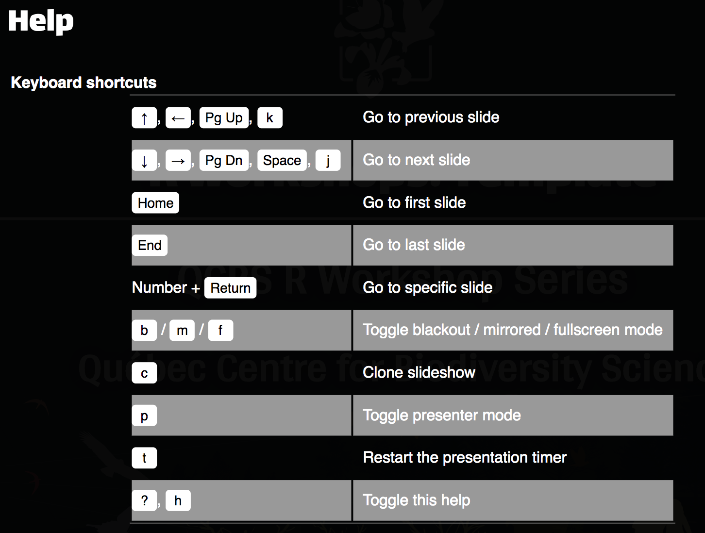

# (R) Markdown

<br>

This is an `R` Markdown document. Markdown is a simple formatting syntax for authoring HTML, PDF, and MS Word documents. For more details on using R Markdown see <http://rmarkdown.rstudio.com>.

When you click the **Knit** button a document will be generated that includes both content as well as the output of any embedded R code chunks within the document.


New changes coming soon!


---
# Using the `xaringan` presentation theme

<br>

This template has been customized using the base from the `xaringan` package. To install it from the [CRAN](https://cran.r-project.org/web/packages/xaringan/index.html), do the following:

```{r, eval = FALSE}
install.packages("xaringan")
```

You may also install its developmental version from their Github repository:

```{r, eval = FALSE}
devtools::install_github("yihui/xaringan")
```

---
# Setup the YAML

.small[
The standard YAML for this presentation follows as below:


```{r, eval = FALSE}
---
title: "Template guide for the QCBS R Workshop Series"
subtitle: "<hr>"
author: "Québec Centre for Biodiversity Science"
output:
  xaringan::moon_reader:
    includes:
      in_header: "qcbsR-header.html"
    lib_dir: assets
    seal: true
    css: ["default", "qcbsR.css", "qcbsR-fonts.css"]
    nature:
      beforeInit: "qcbsR-macros.js"
      highlightStyle: github
      highlightLines: true
---
```
]

.footnote[Remember that any changes to the `CSS` must be made within the repository of this template, and not within the repositories of the workshops.If you feel that something must be changed, contact one of the coordinators.]

---

# Setting the global settings

Global options for the presentation are set within a hidden chunk within the first slide, right after the YAML. 

```{r setup, echo = TRUE}
knitr::opts_chunk$set(
  comment = "#",
  collapse = TRUE,
  warning = FALSE,
  message = FALSE,
  fig.width=6, fig.height=6,
  fig.retina = 3,
  fig.align = 'center'
)

options(repos = structure(c(CRAN = "http://cran.r-project.org")))
```

---

# Creating new slides

New slides are separated by `---`. 

You may also incrementally add content to a slide using `--`.

--

Like this.

--

And this.

---
class: inverse, center, middle

# This is a section slide

## with a subtitle
---

# Headers

You can use from `#` to `######` to set headers, corresponding to `.h1` to `.h6` within the `CSS` document.

<br>

# Headers 1 (with a blue background) `h1`

## Header 2 (similar to `h1` with no blue background)

### Header 3

#### Header 4

##### Header 5

###### Header 6

---
# Text Formatting

Slide content can be manipulated using the variables defined within the `CSS` document, as well as standard `markdown` terms.

.pull-left[
- `.huge[huge]` &nbsp; .huge[huge]
- `.xlarge[xlarge]` &nbsp; .xlarge[xlarge]
- `.large[large]` &nbsp; .large[large]
- `.small[small]` &nbsp; .small[small]
- `.xsmall[xsmall]` &nbsp; .xsmall[xsmall]
- `.tiny[tiny]` &nbsp; .tiny[tiny]
- `.alert[alert]` .alert[alert]
- `.comment[comment]` .comment[comment]
]

.pull-right[
- This is normal text.
- This is `in-line code`.
- `$\LaTeX$` $\LaTeX$-friendly terms
- `*italic*` &nbsp; *italic*
- `**bold**` &nbsp; **bold**
- `[]()` allows for [links]()
- This is [`in-line hyperlink`]().
]
<br>

```
This is 
a code chunk.

```

.footnote[.small[This is a small footnote done with a nested `.footnote[.small[]]`.]]
---
# Text Formatting

### Custom `remarkjs`'s macros

###### Scaling images

- `` to scale an image

<br>

###### Using FontAwesome v4.7.0 icons
.pull-left[
.small[

- `` &nbsp; 
- `` &nbsp; 
- `` &nbsp; 
- `` &nbsp; 
]
]

.pull-right[
See [FontAwesome cheatsheet](https://fontawesome.com/v4.7.0/cheatsheet/)


<br>

<br>

<br>
]


Behind the scenes:

```js
// Font-awesome icons (version 4.7)
remark.macros.faic = function (size = 1.5) {
  var name = this;
  return '<i class="fa fa-'+ name + ' fa-'+ size + 'x" aria-hidden="true"></i>';
};
```

---
# Slide with bullet points

.pull-left[
###### Using `*` followed by a space:

* a picture
* says more
* than a thousand words

###### Using `-` followed by a space:

- a picture
- says more
- than a thousand words

###### Using `-` or `*` followed by two spaces:

- Level 1 item
  * Level 2 item
  * Level 2 item
- Level 1 item

]

.pull-right[
###### Using numbers followed by `.` and a space:

1. item 1
1. item 2
1. item 3
2. item 4
4. item 5

<br>

###### Using numbers followed by `.` and a space:

1. item 1
  1. item 2
  1. item 1
2. item 2

]
---
# Incremental slides and incremental bullets

<br>

The easiest way to build incremental slides is...

--

...to use **two dashes** `--` to separate content within a slide, and even bullet points:


--

- Bullet 1
--

- Bullet 2
--

- Bullet 3

--

And, whenever you feel like a line break is needed, simply use the HTML tag `<br>`.

<br>

<br>

Here. (This is preceded by two `<br>` separated by returns.)

---
# Columns

Multiple column types are within the CSS.

They are variations of `.pull-left[]`, to bring the content to the left side, and `.pull-right[]` to bring the content to the right. 

**Examples**

.pull-left[
Standard `.pull-left[]` has 47% width.

``` 
Code chunk example
```

]

.pull-right[
Standard `.pull-right[]` has 48% width.

``` 
Code chunk example
```

]


.pull-left2[
`.pull-left2[]` 
has 67% width, with the text going further to the right.

``` 
Code chunk example
```

]


.pull-right2[
`.pull-right2[]` has 30% width.

``` 
Code chunk example
```

]


.pull-left3[
`.pull-left3[]` 
has 57% width, with the text going further to the right.

``` 
Code chunk example
```

]


.pull-right3[
`.pull-right3[]` has 40% width and it should work.

``` 
Code chunk example
```

]

---
# Columns

Multiple column types are within the CSS. 

They are variations of `.pull-left[]`, to bring the content to the left side, and `.pull-right[]` to bring the content to the right. 

**Examples**

.left-code[

Special `.left-code[]` has 57% width and a few colour changes.

``` 
Code chunk example
```

]

.right-plot[

Special `.right-plot[]` has 38% width.

You can write a lot of text here and, because `.left-code[]` has `height: 92%;`, text will not overflow to the left side. 

``` 
Code 

chunk 

example
```
]

---
# Columns

Multiple column types are within the CSS. 

They are variations of `.pull-left[]`, to bring the content to the left side, and `.pull-right[]` to bring the content to the right. 

**Examples**

.pull-left4[

`.pull-left4[]` 
has just 37% width.

``` 
Code chunk example
```

]


.pull-right4[

`.pull-right4[]` has 60% width, taking more control of the screen.

``` 
Code chunk example
```

]

---
# Tables

Tables can be created using the following scheme, or knitr kables!


```

| Tables        | Are           | Cool          |
| ------------- |:-------------:| -------------:|
| right-aligned | centered      | right-aligned |
| stuff         | stuff         | 123           |
| stuff         | stuff         | 456           |

```

<br>

<br>

| Tables        | Are           | Cool          |
| ------------- |:-------------:| -------------:|
| right-aligned | centered      | right-aligned |
| stuff         | stuff         | 123           |
| stuff         | stuff         | 456           |

---
# Aligning content

<br>

.left[
`.left[Left-aligned content]`
]

<br>

.center[
`.center[Centered content]`
]

<br>

.right[
`.right[Right-aligned content]`
]

---
class: inverse, center, middle

background-image: url(https://tailandfur.com//wp-content/uploads/2014/09/beautiful-and-cute-animals-wallpaper-9.jpg)
background-size: contain

# Include background images 

#### Using `background-image` and `background-size` when defining the slide `class`.

.left[
```
---
class: inverse, center, middle

background-image: url(https://tailandfur.com//wp-content/uploads/2014/09/beautiful-and-cute-animals-wallpaper-9.jpg)
background-size: contain
```
]

---
# Images

This image is centered and scaled to 60% of its real size, using:

`.center[ ]`

or

`.center[]`

.center[

]

---
# Images and text

<br>

.pull-left2[
Here `.pull-left2[]` and `.pull-right2[]`  are used to create a 2 column slide, where the left column is larger than the right column.
]

.pull-right2[
Beautiful picture


]

---
class: inverse, center, middle

# Use `R`

<hr>

## A few examples

---
# Code chunk

You can embed an R code chunk like so:


      ```{R, eval = FALSE}
      library(datasets)
      cars[1:2,]
      ```

which yields:

```{R}
library(datasets)
cars[1:2,]
```

---
# Including Plots

```{R}
plot(pressure)
```


---
# Code chunk options
<br>

- `echo`:
  - `echo = TRUE` (default) to include R source code in the output file.
  - `echo = FALSE` to prevent printing of the R source code.
  - `echo = c(2:3)` or `-1` to include only line 2 and 3 from the R source code.
- `eval`:
  - `eval = TRUE` (default) to evaluate the code chunk.
  - `eval = FALSE` to prevent evaluating the code chunk.
  - `eval = c(2:3)` or `-1` to evaluate only line 2 and 3 from the R code.


---
# Code chunk options

<br>


- `fig.width`, `fig.height` to define width and height of the resulting plots
- `fig.align` to align the resulting plots

.alert[See more code chunk options at <https://yihui.name/knitr/options/>]


---
# Including Plots

With `echo = TRUE`:
```{r, echo= TRUE, fig.width=7, fig.height=3.5}
par(mfrow=c(1,2), mar = c(4,4,0,1), las = 1)
plot(pressure)
plot(cars)
```


---
# Including Plots

With `echo = -1`:
```{r, echo=-1, fig.width=7, fig.height=3.5}
par(mfrow = c(1,2), mar = c(4, 4, 0, 1))
plot(pressure)
plot(cars)
```

---
# Including Plots


If the option `highlightLines: true` is used for the presentation (declared in the YAML header), then add `#<<` at the end of the lines to be highlighted.

```{r, echo=TRUE, fig.width=7, fig.height=3.5}
par(mfrow=c(1,2), mar = c(4,4,0,1), las = 1)
plot(pressure) #<<
plot(cars) #<<
```

---
# Challenge slide! 

To include the Rubik's cube in the challenge slide, you just need to type `` next to the slide title!


---
# Math - use `$`

You can write $\LaTeX$ math expressions inside a pair of dollar signs, e.g. `$\alpha+\beta$` renders $\alpha+\beta$.

You can use the display style with a pair of double dollar signs `$$` :

$$\bar{X}=\frac{1}{n}\sum_{i=1}^nX_i$$


---
class: inverse, center, middle

# Keyboard shortcuts

<hr>

<br><br>

---
# Keyboard shortcuts

To see these shortcuts during a presentation, press **H** or **?**

.center[]

---
# Classes

You may use classes to change the structure of your slide

```
---
exclude: true
class: inverse, center, middle

Content goes here
---
```

You may hide slides by applying

---
.pull-left[
.center[
##### Contributing
If you have any comments and suggestions, please go to the [QCBSRworkshops/templateRepository ](https://github.com/QCBSRworkshops/templateRepository) Github repository for this template.

<br>

You may also contact the [ current coordinators](https://wiki.qcbs.ca/r#questions) of the QCBS R Workshop Series.

]
]

.pull-right[
##### Developers and contributors

This template has been originally developed by [Marie Hélène Brice](mailto:) and [Kevin Cazelles](mailto:). 

[Pedro H. P. Braga](mailto:) has changed this presentation, the CSS and the JS files to add more clarification and flexibility.

See [here and below](https://github.com/QCBSRworkshops/templateWorkshops/graphs/contributors) to find all contributors and developers of this template.
]

.footnote[.center[[This work is licensed under a Creative Commons Attribution-NonCommercial-ShareAlike 4.0 International License. ](https://creativecommons.org/licenses/by-sa/4.0/deed.fr)]]
---
class: inverse, center, bottom

# Thank you for your implication!

<hr>


<br>